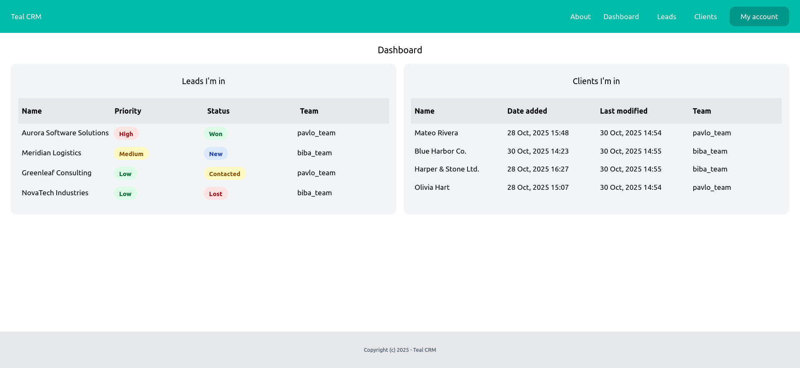
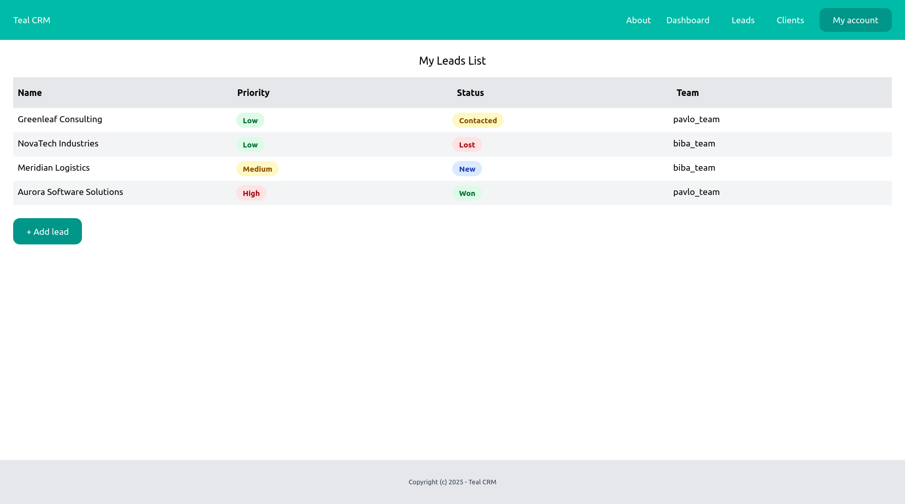
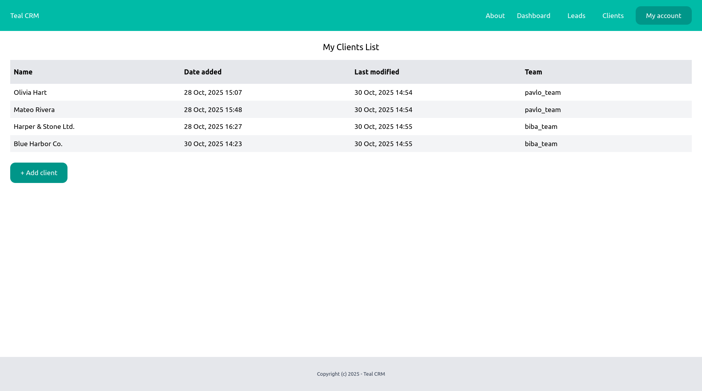

# Teal CRM (Django)

## Description
Teal CRM is a lightweight CRM built with Django that helps track Leads and Clients within Teams (workspaces). Each user can sign up, manage their own records, and operate inside a Team with a selected Plan that limits how many leads/clients can be created. It’s a clean starter for learning and extending a multi-tenant CRM.

## ✨ Demo
- Live demo: — coming soon — (TBD)
- Screenshots:
  - Dashboard: 
  - Leads: 
  - Clients: 

## 🚀 Features
- User authentication (signup, login, logout, account) ([userprofile/urls.py](userprofile/urls.py))
- Leads: list, detail, create, edit, delete, convert to client ([lead/urls.py](lead/urls.py))
- Clients: list, detail, create, edit, delete ([client/urls.py](client/urls.py))
- Teams (workspaces) with per-user default team; Plans limiting max leads/clients ([team/models.py](team/models.py))
- Dashboard overview for leads and clients ([dashboard/views.py](dashboard/views.py))
- Admin to manage Teams and Plans ([team/admin.py](team/admin.py))

## 🛠️ Technologies Used
- Python 3.11+
- Django 5.2
- PostgreSQL
- npm package manager
- Tailwind CSS
- python-decouple for environment variables

## 🏃 How to Run Locally

1) Prerequisites (Linux)
- Python 3.11+ (pip, virtualenv)
- PostgreSQL 14+ (or compatible)
- Node.js 22.14+
- npm 11.6+
- Git


2) Clone the repository
```bash
git clone https://github.com/Solidarov/django-crm.git
```

3) Create and activate a virtual environment
```bash
python3 -m venv .venv
source .venv/bin/activate
```

4) Install dependencies
```bash
pip install -r ./django-crm/requirements.txt
```

5) Create the database and user (PostgreSQL)
```bash
sudo -u postgres psql
-- In the psql shell:
CREATE USER <your-user> WITH PASSWORD '<your-pass>';

ALTER ROLE <your-user> SET client_encoding TO 'utf8';
ALTER ROLE <your-user> SET default_transaction_isolation TO 'read committed';
ALTER ROLE <your-user> SET timezone TO 'UTC';

CREATE DATABASE <your-db> OWNER <your-user>;
GRANT ALL PRIVILEGES ON DATABASE <your-db> TO <your-user>;
\q
```

6) Configure environment variables
Create a .env file in django-crm/ (same folder as crm_core/settings.py):
```env
SECRET_KEY=replace-with-a-strong-secret-key
DEBUG=True
ALLOWED_HOSTS=localhost,127.0.0.1

DB_NAME=<your-db>
DB_USER=<your-user>
DB_PASSWORD=<your-pass>
DB_HOST=localhost
DB_PORT=5432
```

7) Apply migrations and create a superuser
```bash
python manage.py migrate
python manage.py createsuperuser
```

8) Install npm package manager dependencies
```bash
npm ci
```

9) Build Tailwind CSS file
```bash
npx @tailwindcss/cli -i ./core/static/core/css/main.css -o ./core/static/core/css/main_output.css
``` 

10) (Optional) Seed minimal business data
- Log in to the admin at http://127.0.0.1:8000/admin/
- Create the one Basic Plan under Team > Plans (name "Basic" is required)
- Sign up via the app or use your superuser to create a normal user; ensure the user’s Team has a Basic Plan assigned (via Teams UI or Admin).

11) Run the development server
```bash
python manage.py runserver
```
